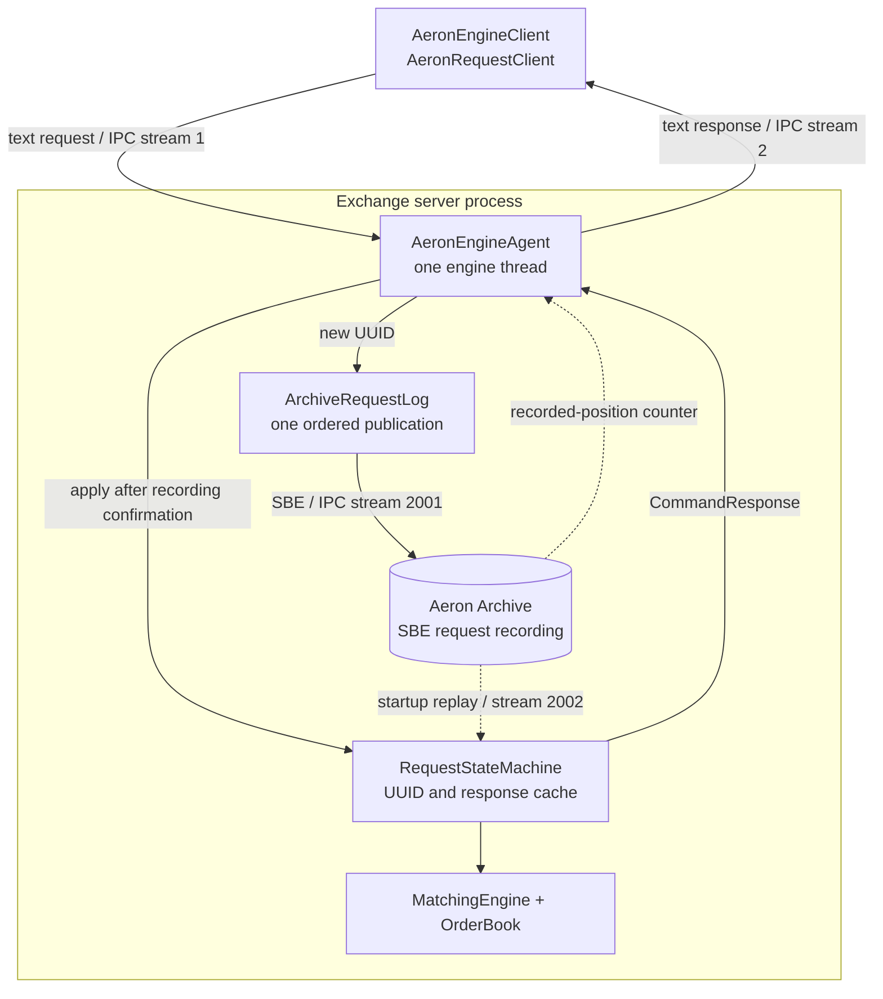
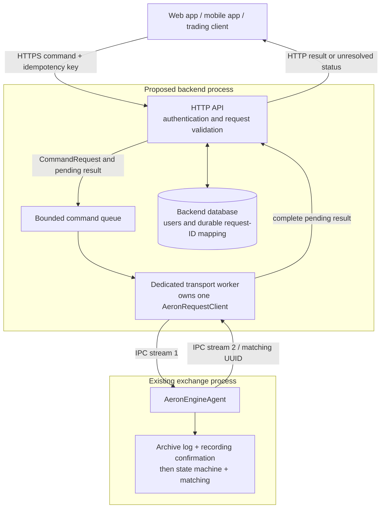
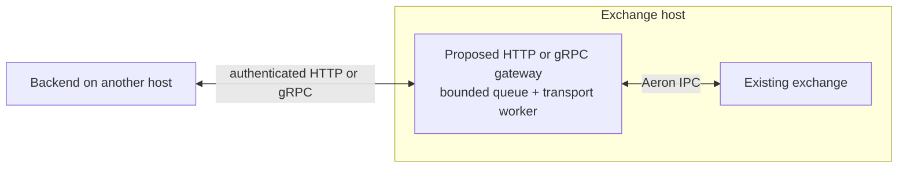

# Exchange architecture and backend integration

The exchange currently runs as a Java process with an embedded Aeron Media Driver and Archive. It owns matching, the live order book, the ordered request recording, and the request-response cache. A separate backend can act as its client.

## Current architecture

Everything below exists today. The demo client runs in a separate process on the same machine.

The arrows between client and agent are transported through the server-owned Media Driver's shared-memory buffers. The Archive recording is persistent storage; driver buffers are disposable. There is no HTTP API or external backend yet.

### The important boundaries

- **Transport:** `AeronRequestClient` sends UUID-wrapped commands and waits for the matching response. Both wire directions currently use text codecs. The persistent request log uses SBE.
- **Ordering:** the engine agent chooses one processing order across incoming client sessions. Its single `ExclusivePublication` records that order. Separate client sessions have no shared ordering guarantee by themselves. [Aeron ordering documentation](https://aeron.io/docs/aeron/aeron-channel-stream-session/)
- **Persistence:** a successful publication offer only places bytes in Aeron's buffer. The agent waits across `doWork()` passes until Archive's recording position reaches that message's end position. File/catalog sync level 2 forces data and metadata before the engine proceeds.
- **Execution:** `RequestStateMachine` handles retries and UUID conflicts, then delegates fresh commands to `MatchingEngine`. It caches successful results and business rejections. `OrderBook` holds the authoritative live order state.
- **Recovery:** before opening the live request subscription, startup replays the recording into a fresh state machine, restoring the book and response cache. The server then extends the same recording. It does not send old replies during replay.

Known UUIDs return their cached response or a conflict response without appending again. If the process stops after recording but before execution or reply delivery, replay applies the request; retrying the same UUID returns its original outcome. An unanswered request has an **unknown outcome**, not a confirmed failure.

## Proposed backend integration: separate process, same host

The backend and its queue below are proposed. The transport client and exchange already exist.

This is the smallest integration I would build first:

1. The HTTP handler authenticates the caller and checks the request shape. It maps the caller's idempotency key to one stable engine UUID and the exact command. Preserve that mapping across backend restarts; scope keys to the caller and reject reuse with changed payloads.
2. It places the request and a pending result (for example, a `CompletableFuture`) on a bounded queue. If the queue is full before admission, reject or defer the request rather than growing memory without limit.
3. One dedicated worker owns the publication, subscription, and `AeronRequestClient`. It calls `send(request)` serially and completes the correct pending result for the HTTP layer. The current client is mutable, synchronous, and supports one outstanding request; do not call the same instance concurrently from HTTP threads or an event loop.
4. When the matching response arrives, the API returns the business result. If a timeout occurs after possible submission, preserve the UUID and expose an unresolved outcome. HTTP cancellation does not roll back an exchange command. The caller can retry the same logical request without creating a new order.

Keep `MatchingEngine` and `OrderBook` inside the exchange. The backend's database can own users, API metadata, and request-ID mappings. That database does not become a second writer of the live book. Persisting the backend UUID mapping and recording an exchange request are two separate operations; crash recovery must resume with the same UUID rather than inventing a new one.

### If the backend runs on another machine

`aeron:ipc` requires shared local memory, so a remote backend cannot connect by pointing at the exchange's driver directory. Aeron clients in separate local processes can share a Media Driver; network transport uses UDP. [Aeron Media Driver documentation](https://aeron.io/docs/aeron/media-driver/)

A small gateway on the exchange host lets a remote backend keep an ordinary request/response API:

Alternatively, we can configure Aeron UDP publications/subscriptions on both hosts, including reply routing and deployment/network policy. The current hard-coded IPC endpoints do not implement that option. Either boundary preserves the same engine-side ordering, recording, and execution flow.

## What still needs to be designed

- **Account ownership and risk:** current commands contain order IDs, prices, quantities, and sides, but no account identity. Authentication at an HTTP boundary alone cannot enforce order ownership or atomic balance/risk limits. Those need explicit command fields and authoritative checks in the sequenced engine state before multi-user trading.
- **Order history and market data:** command responses answer the submitting request. They are not a durable feed for every affected participant. For example, a trade also fills a resting order owned by another caller. A future sequenced, replayable result/event stream can feed query tables and WebSocket updates. That stream and those projections do not exist yet.
- **Scale:** a single transport worker is a simple starting point. Multiple outstanding requests need an asynchronous client with UUID-to-pending-result correlation. Request queues, caches, Archive retention, and snapshots need explicit limits.
- **Availability:** Archive currently persists one local engine. Replication, failover, and Aeron Cluster remain future work.

For the next lesson, build the small same-host backend adapter first: one HTTP operation, one bounded queue, one worker, and a stable request ID that survives retries.
