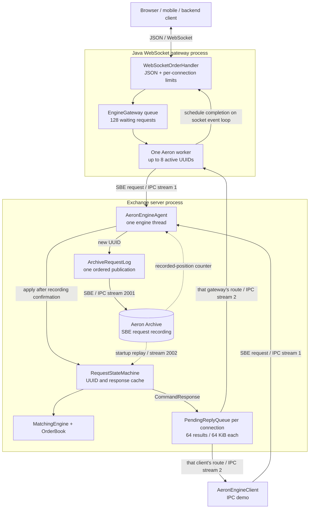

# Exchange architecture and backend integration

The exchange runs as a Java process with an embedded Aeron Media Driver and Archive. It owns matching, the live order book, the ordered request recording, and the request-response cache. A separate Java WebSocket gateway exposes JSON order submission to browser, mobile, and backend clients. The earlier gRPC service and protobuf contract have been removed.

## Current architecture

Multiple local gateway instances can share the engine. Each gateway has a separate Aeron reply
route and bounded reply queue; use a different WebSocket port for each gateway process.
The diagram shows the default limits; the engine launcher can configure reply count, bytes, and timeout.

```mermaid
flowchart TB
  Browser["Browser / mobile / backend client"]
  Client["AeronEngineClient<br/>IPC demo"]
  subgraph Gateway["Java WebSocket gateway process"]
    Socket["WebSocketOrderHandler<br/>JSON + per-connection limits"]
    Queue["EngineGateway queue<br/>128 waiting requests"]
    Worker["One Aeron worker<br/>up to 8 active UUIDs"]
    Socket --> Queue --> Worker
    Worker -->|"schedule completion on socket event loop"| Socket
  end
  subgraph Server["Exchange server process"]
    Agent["AeronEngineAgent<br/>one engine thread"]
    Log["ArchiveRequestLog<br/>one ordered publication"]
    Archive[("Aeron Archive<br/>SBE request recording")]
    State["RequestStateMachine<br/>UUID and response cache"]
    Engine["MatchingEngine + OrderBook"]
    Replies["PendingReplyQueue per connection<br/>64 results / 64 KiB each"]
    Agent -->|"new UUID"| Log
    Log -->|"SBE / IPC stream 2001"| Archive
    Archive -.->|"recorded-position counter"| Agent
    Agent -->|"apply after recording confirmation"| State
    State --> Engine
    State -->|"CommandResponse"| Replies
    Archive -.->|"startup replay / stream 2002"| State
  end
  Browser <-->|"JSON / WebSocket"| Socket
  Client -->|"SBE request / IPC stream 1"| Agent
  Replies -->|"that client's route / IPC stream 2"| Client
  Worker -->|"SBE request / IPC stream 1"| Agent
  Replies -->|"that gateway's route / IPC stream 2"| Worker
```

The IPC arrows use the server-owned Media Driver's shared-memory buffers. The Archive recording is persistent storage; driver buffers are disposable. The WebSocket launcher binds `127.0.0.1:8080/orders`. There is no public HTTP application, authentication, or TLS yet.

The WebSocket adapter adds bounded Netty connections and strict JSON conversion. It hands domain commands to the existing gateway and schedules completions back onto each socket's event loop. JSON encoding and socket writes stay off the Aeron worker. Disconnecting a socket does not cancel an accepted command. See [the contract, browser example, and limits](websocket-contract.md).

### The important boundaries

- **Transport:** one `EngineGateway` worker owns `AeronRequestClient.trySend()` and `pollResponses()`. It correlates complete SBE responses with active UUIDs. Each active request owns its encoded bytes, phase, attempt count, and deadline. Fragment assemblers deliver complete messages to the decoders. The latency benchmark also uses the nonblocking methods, with a configurable window and one successful send per request. The blocking `send()` method remains available for callers that wait for one reply at a time.
- **Admission:** the gateway holds up to 128 waiting requests and eight active requests. A full queue produces an explicit admission rejection. `WebSocketGatewayServer` exposes `--max-in-flight`, `--queue-capacity`, and `--port`; defaults are 8/128/8080. Each WebSocket connection has at most 32 pending responses, and the listener admits at most 128 connections. The engine independently offers up to eight requests to its ordered log by default; `--log-window=<positive integer>` configures that bound. It executes only the recorded FIFO head. Unsent replies queue separately per Aeron client connection, so they no longer block command admission or execution. The order book still has a single writer.
- **Ordering:** the engine agent chooses one processing order across incoming client sessions. Its single `ExclusivePublication` records that order. Separate client sessions have no shared ordering guarantee by themselves. [Aeron ordering documentation](https://aeron.io/docs/aeron/aeron-channel-stream-session/)
- **Persistence:** a successful publication offer only places bytes in Aeron's buffer. The agent waits across `doWork()` passes until Archive's recording position reaches that message's end position. File/catalog sync level 2 forces data and metadata before the engine proceeds.
- **Execution:** `RequestStateMachine` handles retries and UUID conflicts, then delegates fresh commands to `MatchingEngine`. It caches successful results and business rejections. `OrderBook` holds the authoritative live order state.
- **Reply delivery:** each Aeron request image identifies one client connection, usually one gateway process. `ResponsePublicationRegistry` owns that connection's response publication. `PendingReplyQueue` holds up to 64 immutable responses with a total encoded size of at most 64 KiB by default. `ReplyDeliveryConfig` validates configurable count, byte, and timeout limits. SBE size calculation checks admission without serializing the response; actual encoding happens immediately before its offer. Each agent pass attempts only the head of each queue, preserving that connection's reply order and giving other routes a turn even if one is blocked. These queues live on the existing engine thread; there is no new thread per gateway.
- **Recovery:** before opening the live request subscription, startup replays the recording into a fresh state machine, restoring the book and response cache. The server then extends the same recording. It does not send old replies during replay.

Known UUIDs return their cached response or a conflict response without appending again. If the process stops after recording but before execution or reply delivery, replay applies the request; retrying the same UUID returns its original outcome. An unanswered request has an **unknown outcome**, not a confirmed failure.

### Follow one order

Think of the system as three jobs: **accept the request, execute it safely, deliver its answer**.

1. A browser sends a JSON order and request UUID over WebSocket. `WebSocketOrderHandler`
   checks the message and hands the command to `EngineGateway`.
2. The gateway's worker encodes an SBE message and sends it to the engine through
   `AeronRequestClient`. **SBE describes the bytes; Aeron moves them.**
3. `AeronEngineAgent` puts a new request into the ordered Archive log. It waits until
   Archive confirms that request's position is recorded before allowing it to change the book.
4. `RequestStateMachine` calls `MatchingEngine`, which updates `OrderBook`. The state machine
   remembers the result under the UUID, so a retry can recover that exact answer.
5. The agent puts the result into the submitting gateway's reply queue. It tries to send one
   reply from each connection's queue per pass. The gateway matches the UUID and sends JSON
   back to the waiting WebSocket client.

For example, gateway A submits a ten-lot bid and then stops reading replies. Gateway B can
still submit a four-lot ask, trade against that bid, and receive its fill. A's queued placement
response still says ten lots remained **when its bid was placed**. It is an answer to that
command, not a live snapshot of the book.

The latest change is step 5: the engine previously waited on one undelivered reply before
continuing. Now each connection has its own outbox. The matching rules, recording-before-execution
rule, and single writer remain the same.

### When a reply cannot be delivered

- Each queued reply has a fixed deadline starting when its result is prepared (five seconds by default).
  Repeated offers and asynchronous publication registration do not reset it.
- A full queue, an expired reply, or a terminal publication failure disables that connection's
  reply route and discards its queued deliveries. Other routes continue. The route stays
  disabled until that request connection closes; the normal connection scan cannot recreate it.
- Commands already accepted into the log still execute once recording is confirmed, even if
  their client disconnects. Discarding a delivery does not undo an order or remove its cached result.
- A caller with no answer must preserve the UUID and command. After reconnecting through a
  fresh Aeron connection, its retry can receive the cached result without another log entry.
  The current gateway does not automatically rebuild a disabled Aeron connection; restart it
  to establish a fresh route. Reopening only a browser WebSocket does not replace that route.
- A single result above the configured byte budget cannot fit even in an empty queue. Raising
  `--reply-bytes` can accommodate larger results within the Aeron publication and SBE limits.
  Results exceeding the publication's maximum message length or the schema's 65,534-trade limit
  disable only their reply route, preserving execution and the cache. Retrying cannot solve those
  limits; larger results require a future chunking design. The byte budget measures encoded payload,
  not total Java heap use. These per-connection bounds also do not cap the total number of Aeron
  connections or the existing response cache.

`--reply-stats` prints counts of successful offers and discarded replies by cause after the engine
stops. An offer is not a receipt acknowledgment; a cached retry counts as another delivery attempt.
See [the server options and diagnostic meanings](../README.md#reply-limits-and-diagnostics).

Recording failures remain fatal: the engine cannot safely continue a history whose recording
has failed. A slow reply consumer is a delivery problem and no longer stops the whole engine.

## Backend integration

A backend in Go, Java, or another language can connect using the same WebSocket JSON contract. It keeps a connection open, sends requests with stable UUIDs, and matches asynchronous replies by UUID. It does not need protobuf classes, SBE codecs, or access to the Media Driver directory.

The browser/mobile path can reach the gateway directly once production identity and security controls exist. A separate backend can own users, API metadata, and query projections without becoming a second writer of the live order book. If that backend submits orders on a caller's behalf, it must preserve the caller's logical request identity across reconnects and restarts and reject reuse with a changed command.

The current loopback listener accepts local clients only. Remote access requires an explicit deployment design with WSS/TLS and authentication. For a gateway on a different host from the engine, Aeron UDP can replace IPC after configuring both hosts and their reply routes. Pointing a remote process at a driver directory cannot provide IPC across machines. [Aeron Media Driver documentation](https://aeron.io/docs/aeron/media-driver/)

## What still needs to be designed

- **Account ownership and risk:** current commands contain order IDs, prices, quantities, and sides, but no account identity. Authentication at an HTTP boundary alone cannot enforce order ownership or atomic balance/risk limits. Those need explicit command fields and authoritative checks in the sequenced engine state before multi-user trading.
- **Order history and market data:** command responses answer the submitting request. They are not a durable feed for every affected participant. For example, a trade also fills a resting order owned by another caller. A future sequenced, replayable result/event stream can feed query tables and WebSocket updates. That stream and those projections do not exist yet.
- **Scale:** gateway admission, the engine's recording window, and per-connection reply queues are bounded. The engine pipelines recording and continues execution while replies wait, but applies at most one recorded command per pass. Total connection limits, response-cache retention, Archive retention, snapshots, and support for larger responses remain future work.
- **Availability:** Archive currently persists one local engine. Replication, failover, and Aeron Cluster remain future work.

Graceful gateway shutdown rejects new submissions and drains queued and active requests before releasing Aeron resources. An unexpected worker exit fails all remaining futures; requests successfully offered at least once carry an unknown-outcome diagnostic. WebSocket disconnects and client-side timeouts do not undo accepted commands.

Two-client tests now cover isolated routing, slow readers, queue overflow, connection races,
and cached retries after reconnect. Automatic gateway reconnection remains future work.
Production browser access also needs WSS, authenticated sessions, and account/ownership/risk
checks before accepting untrusted orders.
