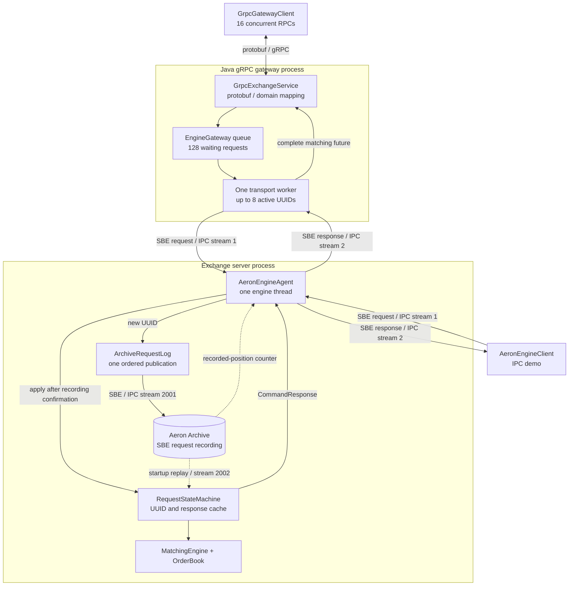
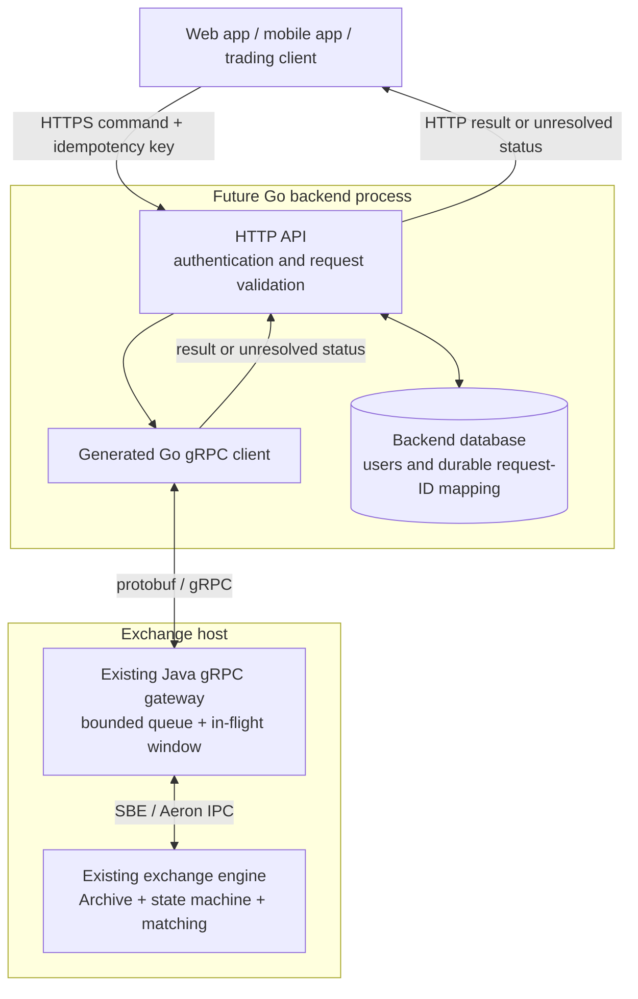
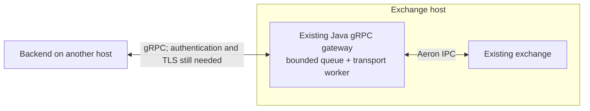

# Exchange architecture and backend integration

The exchange runs as a Java process with an embedded Aeron Media Driver and Archive. It owns matching, the live order book, the ordered request recording, and the request-response cache. A separate Java gRPC gateway exposes this engine to the demo client and a future Go backend.

## Current architecture

The engine, gateway, and demo clients below exist today. The Go backend remains future work.

```mermaid
flowchart TB
  GrpcClient["GrpcGatewayClient<br/>16 concurrent RPCs"]
  Client["AeronEngineClient<br/>IPC demo"]
  subgraph Gateway["Java gRPC gateway process"]
    Service["GrpcExchangeService<br/>protobuf / domain mapping"]
    Queue["EngineGateway queue<br/>128 waiting requests"]
    Worker["One transport worker<br/>up to 8 active UUIDs"]
    Service --> Queue
    Queue --> Worker
    Worker -->|"complete matching future"| Service
  end
  subgraph Server["Exchange server process"]
    Agent["AeronEngineAgent<br/>one engine thread"]
    Log["ArchiveRequestLog<br/>one ordered publication"]
    Archive[("Aeron Archive<br/>SBE request recording")]
    State["RequestStateMachine<br/>UUID and response cache"]
    Engine["MatchingEngine + OrderBook"]
    Agent -->|"new UUID"| Log
    Log -->|"SBE / IPC stream 2001"| Archive
    Archive -.->|"recorded-position counter"| Agent
    Agent -->|"apply after recording confirmation"| State
    State --> Engine
    State -->|"CommandResponse"| Agent
    Archive -.->|"startup replay / stream 2002"| State
  end
  Client -->|"SBE request / IPC stream 1"| Agent
  Agent -->|"SBE response / IPC stream 2"| Client
  GrpcClient <-->|"protobuf / gRPC"| Service
  Worker -->|"SBE request / IPC stream 1"| Agent
  Agent -->|"SBE response / IPC stream 2"| Worker
```

The IPC arrows use the server-owned Media Driver's shared-memory buffers. The Archive recording is persistent storage; driver buffers are disposable. The gateway currently listens on plaintext gRPC port 50051. There is no application HTTP API or Go backend yet.

### The important boundaries

- **Transport:** one `EngineGateway` worker owns `AeronRequestClient.trySend()` and `pollResponses()`. It correlates complete SBE responses with active UUIDs. Each active request owns its encoded bytes, phase, attempt count, and deadline. Fragment assemblers deliver complete messages to the decoders. The blocking `send()` method remains available for direct callers such as the latency benchmark.
- **Admission:** the gRPC gateway holds up to 128 waiting requests and eight active requests. A full queue rejects new submissions. The two-argument gateway constructor defaults to one active request. These bounds do not introduce concurrent order-book writers: the engine agent still records, executes, and replies one request at a time.
- **Ordering:** the engine agent chooses one processing order across incoming client sessions. Its single `ExclusivePublication` records that order. Separate client sessions have no shared ordering guarantee by themselves. [Aeron ordering documentation](https://aeron.io/docs/aeron/aeron-channel-stream-session/)
- **Persistence:** a successful publication offer only places bytes in Aeron's buffer. The agent waits across `doWork()` passes until Archive's recording position reaches that message's end position. File/catalog sync level 2 forces data and metadata before the engine proceeds.
- **Execution:** `RequestStateMachine` handles retries and UUID conflicts, then delegates fresh commands to `MatchingEngine`. It caches successful results and business rejections. `OrderBook` holds the authoritative live order state.
- **Recovery:** before opening the live request subscription, startup replays the recording into a fresh state machine, restoring the book and response cache. The server then extends the same recording. It does not send old replies during replay.

Known UUIDs return their cached response or a conflict response without appending again. If the process stops after recording but before execution or reply delivery, replay applies the request; retrying the same UUID returns its original outcome. An unanswered request has an **unknown outcome**, not a confirmed failure.

## Future Go backend integration

The Go backend would call the existing Java gRPC gateway. It does not need to share the engine's driver directory or implement the SBE protocol.

```mermaid
flowchart TB
  User["Web app / mobile app / trading client"]
  subgraph Backend["Future Go backend process"]
    API["HTTP API<br/>authentication and request validation"]
    Grpc["Generated Go gRPC client"]
    Store[("Backend database<br/>users and durable request-ID mapping")]
    API --> Grpc
    API <--> Store
    Grpc -->|"result or unresolved status"| API
  end
  subgraph Host["Exchange host"]
    Gateway["Existing Java gRPC gateway<br/>bounded queue + in-flight window"]
    Agent["Existing exchange engine<br/>Archive + state machine + matching"]
    Gateway <-->|"SBE / Aeron IPC"| Agent
  end
  User -->|"HTTPS command + idempotency key"| API
  API -->|"HTTP result or unresolved status"| User
  Grpc <-->|"protobuf / gRPC"| Gateway
```

The integration responsibilities are:

1. The HTTP handler authenticates the caller and checks the request shape. It maps the caller's idempotency key to one stable engine UUID and the exact command. Preserve that mapping across backend restarts; scope keys to the caller and reject reuse with changed payloads.
2. The backend makes a gRPC call with that UUID and command. The Java service maps protobuf to `CommandRequest` and submits it to the bounded gateway queue. Admission failures become `UNAVAILABLE` responses.
3. One dedicated gateway worker owns the publication, subscription, and `AeronRequestClient`. Each pass polls responses, checks deadlines, admits work, and attempts nonblocking offers. A response completes the future associated with its UUID. Each successful offer counts as an attempt; temporary back pressure does not consume the retry budget. Active UUIDs are not overwritten by queued requests with the same UUID.
4. When the matching response arrives, the API returns the business result. If a timeout occurs after possible submission, preserve the UUID and expose an unresolved outcome. HTTP cancellation does not roll back an exchange command. The caller can retry the same logical request without creating a new order.

Keep `MatchingEngine` and `OrderBook` inside the exchange. The backend's database can own users, API metadata, and request-ID mappings. That database does not become a second writer of the live book. Persisting the backend UUID mapping and recording an exchange request are two separate operations; crash recovery must resume with the same UUID rather than inventing a new one.

### If the backend runs on another machine

`aeron:ipc` requires shared local memory, so a remote backend cannot connect by pointing at the exchange's driver directory. Aeron clients in separate local processes can share a Media Driver; network transport uses UDP. [Aeron Media Driver documentation](https://aeron.io/docs/aeron/media-driver/)

A gateway on the exchange host lets a remote backend use the same gRPC contract:

```mermaid
flowchart LR
  Remote["Backend on another host"]
  subgraph Host["Exchange host"]
    Gateway["Existing Java gRPC gateway<br/>bounded queue + transport worker"]
    Engine["Existing exchange"]
    Gateway <-->|"Aeron IPC"| Engine
  end
  Remote <-->|"gRPC; authentication and TLS still needed"| Gateway
```

Alternatively, we can configure Aeron UDP publications/subscriptions on both hosts, including reply routing and deployment/network policy. The current hard-coded IPC endpoints do not implement that option. Either boundary preserves the same engine-side ordering, recording, and execution flow.

## What still needs to be designed

- **Account ownership and risk:** current commands contain order IDs, prices, quantities, and sides, but no account identity. Authentication at an HTTP boundary alone cannot enforce order ownership or atomic balance/risk limits. Those need explicit command fields and authoritative checks in the sequenced engine state before multi-user trading.
- **Order history and market data:** command responses answer the submitting request. They are not a durable feed for every affected participant. For example, a trade also fills a resting order owned by another caller. A future sequenced, replayable result/event stream can feed query tables and WebSocket updates. That stream and those projections do not exist yet.
- **Scale:** gateway queues and active requests are bounded, and UUID correlation supports multiple outstanding requests. The engine still waits for recording and reply delivery per command. Server-side batching, response-cache retention, Archive retention, and snapshots remain future work.
- **Availability:** Archive currently persists one local engine. Replication, failover, and Aeron Cluster remain future work.

Graceful gateway shutdown rejects new submissions and drains queued and active requests before releasing Aeron resources. An unexpected worker exit fails all remaining futures; requests successfully offered at least once carry an unknown-outcome diagnostic. RPC deadlines and cancellation do not undo accepted commands.

The next engine lesson is a bounded queue of logged requests, processed in order as Archive's recorded position reaches their end positions.
