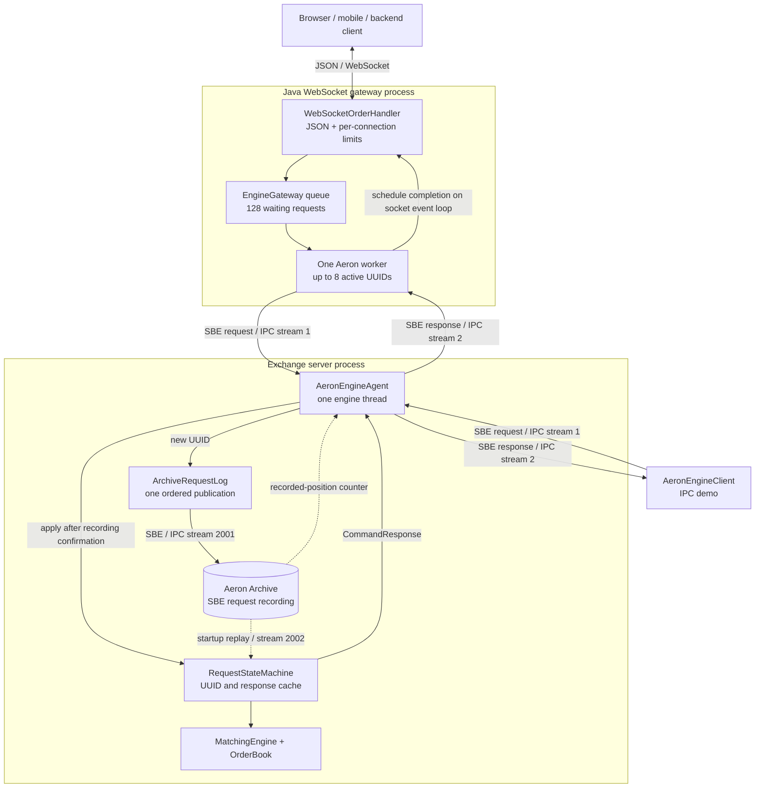

# Exchange architecture and backend integration

The exchange runs as a Java process with an embedded Aeron Media Driver and Archive. It owns matching, the live order book, the ordered request recording, and the request-response cache. A separate Java WebSocket gateway exposes JSON order submission to browser, mobile, and backend clients. The earlier gRPC service and protobuf contract have been removed.

## Current architecture

Run one gateway instance for the current lesson; multi-gateway reply isolation remains future work.

```mermaid
flowchart TB
  Browser["Browser / mobile / backend client"]
  Client["AeronEngineClient<br/>IPC demo"]
  subgraph Gateway["Java WebSocket gateway process"]
    Socket["WebSocketOrderHandler<br/>JSON + per-connection limits"]
    Queue["EngineGateway queue<br/>128 waiting requests"]
    Worker["One Aeron worker<br/>up to 8 active UUIDs"]
    Socket --> Queue --> Worker
    Worker -->|"schedule completion on socket event loop"| Socket
  end
  subgraph Server["Exchange server process"]
    Agent["AeronEngineAgent<br/>one engine thread"]
    Log["ArchiveRequestLog<br/>one ordered publication"]
    Archive[("Aeron Archive<br/>SBE request recording")]
    State["RequestStateMachine<br/>UUID and response cache"]
    Engine["MatchingEngine + OrderBook"]
    Agent -->|"new UUID"| Log
    Log -->|"SBE / IPC stream 2001"| Archive
    Archive -.->|"recorded-position counter"| Agent
    Agent -->|"apply after recording confirmation"| State
    State --> Engine
    State -->|"CommandResponse"| Agent
    Archive -.->|"startup replay / stream 2002"| State
  end
  Browser <-->|"JSON / WebSocket"| Socket
  Client -->|"SBE request / IPC stream 1"| Agent
  Agent -->|"SBE response / IPC stream 2"| Client
  Worker -->|"SBE request / IPC stream 1"| Agent
  Agent -->|"SBE response / IPC stream 2"| Worker
```

The IPC arrows use the server-owned Media Driver's shared-memory buffers. The Archive recording is persistent storage; driver buffers are disposable. The WebSocket launcher binds `127.0.0.1:8080/orders`. There is no public HTTP application, authentication, or TLS yet.

The WebSocket adapter adds bounded Netty connections and strict JSON conversion. It hands domain commands to the existing gateway and schedules completions back onto each socket's event loop. JSON encoding and socket writes stay off the Aeron worker. Disconnecting a socket does not cancel an accepted command. See [the contract, browser example, and limits](websocket-contract.md).

### The important boundaries

- **Transport:** one `EngineGateway` worker owns `AeronRequestClient.trySend()` and `pollResponses()`. It correlates complete SBE responses with active UUIDs. Each active request owns its encoded bytes, phase, attempt count, and deadline. Fragment assemblers deliver complete messages to the decoders. The latency benchmark also uses the nonblocking methods, with a configurable window and one successful send per request. The blocking `send()` method remains available for callers that wait for one reply at a time.
- **Admission:** the gateway holds up to 128 waiting requests and eight active requests. A full queue produces an explicit admission rejection. `WebSocketGatewayServer` exposes `--max-in-flight`, `--queue-capacity`, and `--port`; defaults are 8/128/8080. Each connection has at most 32 pending responses, and the listener admits at most 128 connections. The engine independently offers up to eight requests to its ordered log by default; `--log-window=<positive integer>` configures that bound. It executes only the recorded FIFO head and retains one pending reply; an unsent reply blocks further admission and execution. The order book still has a single writer.
- **Ordering:** the engine agent chooses one processing order across incoming client sessions. Its single `ExclusivePublication` records that order. Separate client sessions have no shared ordering guarantee by themselves. [Aeron ordering documentation](https://aeron.io/docs/aeron/aeron-channel-stream-session/)
- **Persistence:** a successful publication offer only places bytes in Aeron's buffer. The agent waits across `doWork()` passes until Archive's recording position reaches that message's end position. File/catalog sync level 2 forces data and metadata before the engine proceeds.
- **Execution:** `RequestStateMachine` handles retries and UUID conflicts, then delegates fresh commands to `MatchingEngine`. It caches successful results and business rejections. `OrderBook` holds the authoritative live order state.
- **Recovery:** before opening the live request subscription, startup replays the recording into a fresh state machine, restoring the book and response cache. The server then extends the same recording. It does not send old replies during replay.

Known UUIDs return their cached response or a conflict response without appending again. If the process stops after recording but before execution or reply delivery, replay applies the request; retrying the same UUID returns its original outcome. An unanswered request has an **unknown outcome**, not a confirmed failure.

## Backend integration

A backend in Go, Java, or another language can connect using the same WebSocket JSON contract. It keeps a connection open, sends requests with stable UUIDs, and matches asynchronous replies by UUID. It does not need protobuf classes, SBE codecs, or access to the Media Driver directory.

The browser/mobile path can reach the gateway directly once production identity and security controls exist. A separate backend can own users, API metadata, and query projections without becoming a second writer of the live order book. If that backend submits orders on a caller's behalf, it must preserve the caller's logical request identity across reconnects and restarts and reject reuse with a changed command.

The current loopback listener accepts local clients only. Remote access requires an explicit deployment design with WSS/TLS and authentication. For a gateway on a different host from the engine, Aeron UDP can replace IPC after configuring both hosts and their reply routes. Pointing a remote process at a driver directory cannot provide IPC across machines. [Aeron Media Driver documentation](https://aeron.io/docs/aeron/media-driver/)

## What still needs to be designed

- **Account ownership and risk:** current commands contain order IDs, prices, quantities, and sides, but no account identity. Authentication at an HTTP boundary alone cannot enforce order ownership or atomic balance/risk limits. Those need explicit command fields and authoritative checks in the sequenced engine state before multi-user trading.
- **Order history and market data:** command responses answer the submitting request. They are not a durable feed for every affected participant. For example, a trade also fills a resting order owned by another caller. A future sequenced, replayable result/event stream can feed query tables and WebSocket updates. That stream and those projections do not exist yet.
- **Scale:** gateway queues and active requests are bounded, and UUID correlation supports multiple outstanding requests. The engine still waits for recording and reply delivery per command. Server-side batching, response-cache retention, Archive retention, and snapshots remain future work.
- **Availability:** Archive currently persists one local engine. Replication, failover, and Aeron Cluster remain future work.

Graceful gateway shutdown rejects new submissions and drains queued and active requests before releasing Aeron resources. An unexpected worker exit fails all remaining futures; requests successfully offered at least once carry an unknown-outcome diagnostic. WebSocket disconnects and client-side timeouts do not undo accepted commands.

The next gateway lesson is two gateway instances with isolated Aeron reply routing, followed by reconnect tests across those instances. Production browser access also needs WSS, authenticated sessions, and account/ownership/risk checks before accepting untrusted orders.
