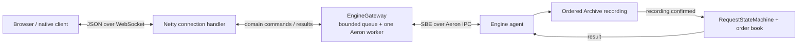

# WebSocket order gateway

The local endpoint is **`ws://127.0.0.1:8080/orders`**. It accepts JSON text messages and returns one correlated result per admitted request while the connection remains available.



## Run in Zed

1. Run `AeronEngineServer.main` using the class play button and leave it running.
2. Run `WebSocketGatewayServer.main`. Wait for the listening message.
3. Connect a WebSocket client to the URL above. A `ws://` URL cannot be opened as a webpage in the browser address bar; use JavaScript's `WebSocket` API as shown below. Browser pages must be served from `http://localhost:<port>` or `http://127.0.0.1:<port>` (HTTPS origins on those hosts are also allowed). Other browser origins, including `file://`/`null`, are rejected. Native clients may omit Origin.
4. Stop the gateway with **⌃C** before stopping the engine. Accepted commands drain through the gateway even though its sockets close.

The launchers share the engine's local Media Driver and must use the same `java.io.tmpdir`. Keep the existing `--add-opens=java.base/jdk.internal.misc=ALL-UNNAMED` JVM setting. Optional gateway arguments:

```text
--port=8080 --queue-capacity=128 --max-in-flight=8
```

Run one gateway instance for this lesson; isolated routing between multiple instances is the next lesson. The previous gRPC service, client, and protobuf definitions have been removed.

## Submit a command

Every command needs a full UUID `requestId` and exactly one `place` or `cancel` object. The codec rejects unknown or repeated fields and invalid types. Order IDs use signed Java `long`; prices and quantities must be positive Java `long` values.

**All 64-bit values are decimal strings**, in requests and results. JavaScript numbers cannot represent every Java `long` exactly. Keep strings, or use `BigInt` locally and convert to strings before `JSON.stringify`.

```json
{
  "requestId": "aaaaaaaa-aaaa-4aaa-8aaa-aaaaaaaaaaa1",
  "place": {
    "orderId": "1001",
    "side": "BID",
    "priceTicks": "100",
    "quantityLots": "10"
  }
}
```

```json
{
  "requestId": "aaaaaaaa-aaaa-4aaa-8aaa-aaaaaaaaaaa2",
  "cancel": { "orderId": "1001" }
}
```

### Connect from a browser

From the repository root, serve the documentation directory as a local page:

```sh
python3 -m http.server 8000 --bind 127.0.0.1 --directory docs
```

Open **`http://127.0.0.1:8000`** in the browser, open its developer tools' JavaScript console, and run the following example. The HTTP page supplies a permitted local origin; JavaScript opens the separate WebSocket connection to port 8080. Keep both Java services running. Stop this extra HTTP server with **⌃C** when finished.

`side` is exactly `BID` or `ASK`:

```javascript
const socket = new WebSocket("ws://127.0.0.1:8080/orders");
const request = {
  requestId: crypto.randomUUID(),
  place: { orderId: "1001", side: "BID", priceTicks: "100", quantityLots: "10" }
};
socket.onmessage = event => console.log(JSON.parse(event.data));
socket.onopen = () => {
  console.log("Connected to the order gateway");
  socket.send(JSON.stringify(request));
};
socket.onclose = event => console.log("Disconnected", event.code, event.reason);
socket.onerror = event => console.error("WebSocket error", event);
```

Saving `request` matters: after an uncertain outcome, reconnect and send **the same UUID and identical command**. A fresh UUID creates a new logical request. A production client must persist unresolved requests across its own restart. The sample generates a new UUID each run but reuses order ID 1001, so repeated runs can receive a duplicate-order rejection.

## Results

A completed request has its original `requestId` and one result object. A successful `socket.send()` only queues bytes locally; the application result is the confirmation of engine processing.

```json
{"requestId":"aaaaaaaa-aaaa-4aaa-8aaa-aaaaaaaaaaa1","place":{"orderId":"1001","remainingLots":"10","trades":[]}}
```

A crossing order's `trades` array contains entries such as:

```json
{"incomingOrderId":"1002","restingOrderId":"1001","priceTicks":"100","quantityLots":"4"}
```

```json
{"requestId":"aaaaaaaa-aaaa-4aaa-8aaa-aaaaaaaaaaa2","cancel":{"orderId":"1001","cancelled":true}}
```

Cancelling a missing order produces `cancelled:false`. Business rejection is also a completed result:

```json
{"requestId":"aaaaaaaa-aaaa-4aaa-8aaa-aaaaaaaaaaa3","reject":{"orderId":"1001","reason":"DUPLICATE_ORDER_ID"}}
```

`REQUEST_ID_CONFLICT` means that UUID was already used with a different command. Retrying an identical request returns its original cached result, including after Archive recovery; it does not execute again. A cached place result describes the original execution, **not the order's current remaining quantity**.

Responses may arrive out of order. Match them using `requestId`. Each connection receives only completions of requests it submitted through this adapter. These are command responses, not a market-data or account-event subscription.

## Errors and uncertain outcomes

```json
{"requestId":null,"error":{"code":"INVALID_ARGUMENT","message":"Invalid order message; see the WebSocket contract","outcomeUnknown":false}}
```

| Code | Meaning | Client action |
| --- | --- | --- |
| `INVALID_ARGUMENT` | Decoding/validation failed; nothing admitted. Request ID is null because the message could not be trusted. | Correct the message. |
| `RESOURCE_EXHAUSTED` | Connection pending limit or shared gateway queue is full; this submission was not admitted. | Back off; retry the same UUID and command. |
| `UNAVAILABLE`, `outcomeUnknown:false` | Gateway rejected admission because it is not running. | Reconnect/back off; retain the request identity. |
| `UNAVAILABLE`, `outcomeUnknown:true` | No reliable engine outcome was obtained. | Retry the same UUID and command. |
| `INTERNAL`, `outcomeUnknown:true` | The adapter could not encode the result. | Retain the request; investigate the server. |

An admission rejection describes **this submission**. A previous attempt with the same UUID may already have executed. Socket closure, client cancellation, missing replies, and timeouts never prove an order was undone. Accepted commands continue when their socket disconnects.

## Bounds and lifecycle

- 16 KiB maximum inbound text message, including all fragments; binary data is unsupported.
- 32 pending responses per connection, with a slot retained until the write completes.
- 128 simultaneous connections, plus the shared gateway queue/window limits above.
- 64/128 KiB outbound low/high watermarks; unwritable connections are closed to bound retained output. Large replies can reach that limit even below the separate 1 MiB response cap.
- Connections idle for 60 seconds without inbound traffic close. Native WebSocket ping frames are handled by Netty. Browsers must reconnect after idle closure; an application heartbeat is future work.
- Close code 1003 rejects binary messages; 1009 rejects excessive message size; 1001 announces gateway shutdown. An abrupt close or failure to deliver a result leaves admitted work uncertain.

Each socket's Netty event loop handles JSON and socket writes. The Aeron worker only schedules completion onto that loop, so a socket callback never blocks its polling duty cycle. Shutdown closes the listener and sockets, drains accepted gateway requests, then closes Aeron resources. Pending socket replies are not guaranteed during shutdown.

## Current boundary

This is loopback-only plaintext `ws`. The local Origin guard reduces accidental cross-site access; it is not authentication. Commands still have no account identity or ownership checks. Do not expose this demo endpoint publicly.

Production needs TLS/WSS, authenticated sessions, account ownership and risk checks, deliberate browser-origin policy, rate limits, and an event/query path for reconciliation. Multiple gateways also need isolated reply routing and scoped request identities. Those features, Aeron Cluster, and a WebSocket-versus-gRPC latency benchmark are outside this first slice.
